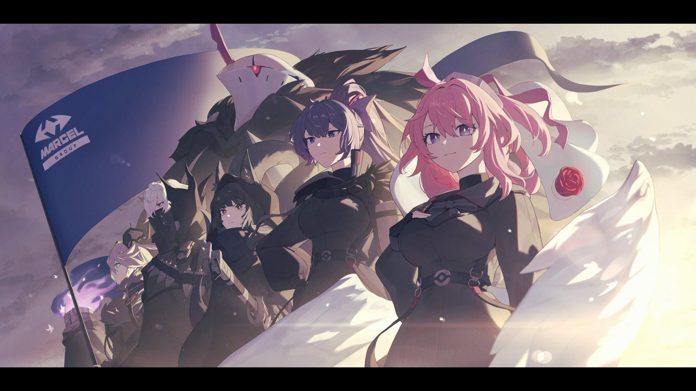
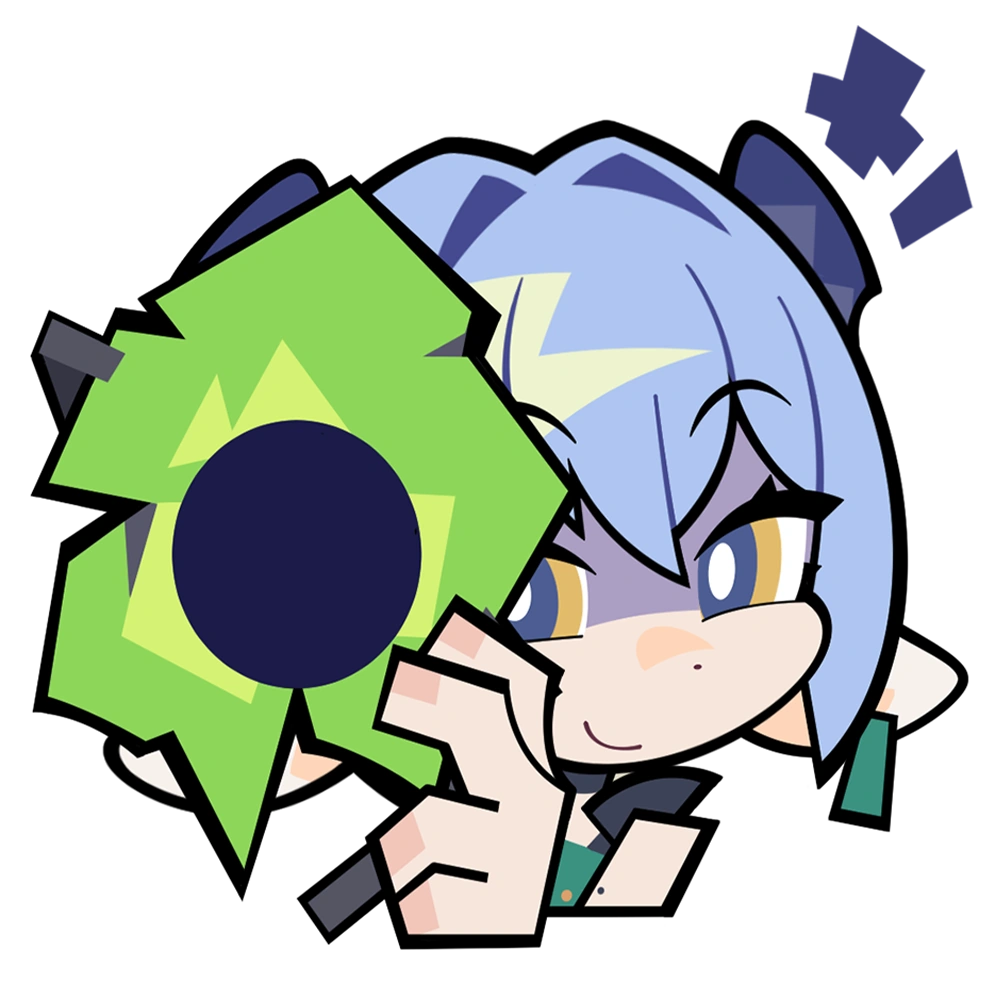
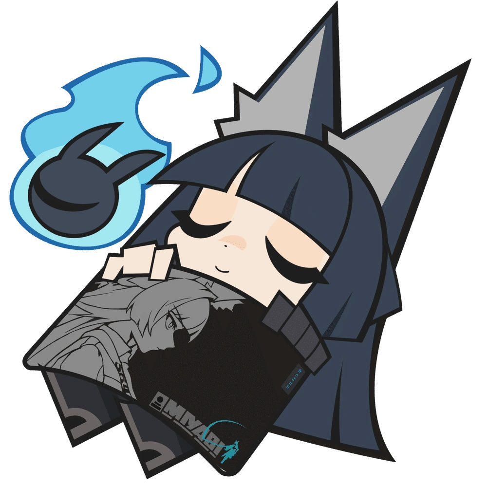

  

<h1 style="color:#111111; margin:10px 0 2px;">Lindverne</h1>

<i>Bem vindo ao meu Perfil</i>

## Um pouco sobre mim

> 🎓 Estudante da **ETEC Lauro Gomes** — turma **3E de Desenvolvimento de Sistemas**.
>
> 💻 Apaixonado por tecnologia, design e código.

## Status do Github

  
  

  

## Stacks

  
  
  
  
  

  
  
  
  
  

## Projetos

  

    <b style="color:#E6C200;">Victoria</b> TCC de monitoramento de água inteligente 💧
  

  

    <b style="color:#D7263D;">SistEstoque</b> Sistema de estoque simples 📦
  

  

    <b style="color:#111111;">✦ em breve …</b> 👀
  

## 🌙 Agora mesmo

> **Nada** *(￣w￣)*
> &nbsp;&nbsp;

## Contato

  

  
  &nbsp;&nbsp;&nbsp;&nbsp;&nbsp;&nbsp;
  

  

